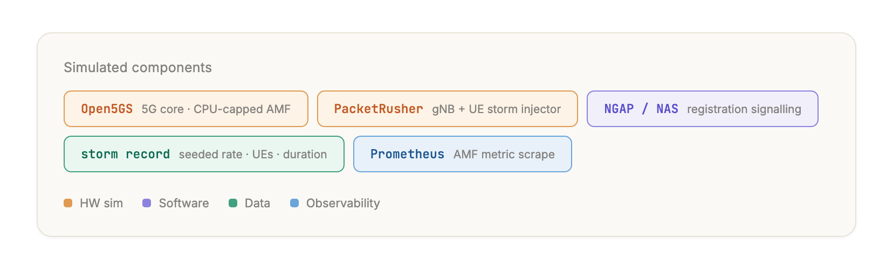

# signal_storm_bench

A 5G core buckles when a re-registration surge floods the AMF faster than it can
process NAS. The on-call engineer has to read the storm off the live counters,
diagnose whether the core is actually overloaded, pick the standards-defined
flow control, and size the back-off that disperses the retry backlog — and do it
the same way every time. This eval makes an agent run exactly that loop against a
live Open5GS core.

It is a **production / mid-horizon** NOC-Bench eval: the deploy question is not
"can a model do this once?" but "can it do it *every* time?", so the headline
metric is **pass^k** over k epochs, not mean accuracy.

> **Status: i1–i4 investigation suite built; ground-truth integrity fixed.** The
> docker-compose Open5GS substrate, the Inspect react agent harness, the
> deterministic live-state scorers, and the single i2 load-state judge are all
> implemented. The offline suite is green (135 tests; ruff + mypy clean) and the
> per-task scorer separation is recorded in `docs/product-score-calibration.md`.
> A live shakeout surfaced a ground-truth-integrity bug: the scorer read live
> state *after* the agent acted, and the agent had a storm-replay tool, so an
> agent could move the numbers it was graded against. The scorer now grades a
> snapshot **frozen at handoff** and the world-mutating tool is removed (see
> Results). The clean pass^k roster (epochs = 3, three models) is pending a
> re-run on the fixed harness; the table and figures below fill from that run.

## Use case

From the GSMA Foundry library: `china-unicom-henan-and-zte-simulating-signal-storms-and-setting-flow-controls`
— China Unicom Henan and ZTE used a digital twin to simulate signalling storms,
evaluate the peak load on the 5G core, recommend flow-control parameters, and
verify them before a risky operation (such as a disaster-recovery switchover).
This eval keeps the operator loop and drops the twin: a real storm is injected
against a real Open5GS core, and the agent measures it off live metrics (i1),
diagnoses the load state (i2), selects the NGAP/NAS flow control (i3), and sizes
the NAS back-off (i4). The apply-and-verify step (applying a Traffic Load
Reduction and re-firing the storm) is a follow-up plan (P1).

Each sample is one step of that loop. Only the **outcome** is graded — the JSON
answer the agent submitted, checked against the live core state and the normative
NGAP/NAS bounds — never the path it took. The agent investigates the running core
through Prometheus and the AMF config; it must not guess. The core enforces no
flow control of its own (see Environment), so the selection and sizing tasks are
graded as reasoning against the live peak and the live `amfcfg.yaml`, not as a
setting the core acts on.

## Capabilities

To solve this use case the agent has to:

- **Measure the storm** — scrape the AMF registration counters off Prometheus and
  quantify the surge: how many initial-registration requests arrived, the peak
  request rate, how many succeeded, and the shortfall. *(i1)*
- **Diagnose the load state** — decide whether the core is under an overload or at
  normal load, and whether any operator action is warranted, backed by the
  measured numbers — in both a storm world and an idle baseline world. *(i2)*
- **Select the flow control** — tell the genuine NGAP/NAS overload-control
  mechanisms apart from non-control distractors, and name the traffic the chosen
  overload action protects versus the traffic it sheds. *(i3)*
- **Size the back-off** — derive a NAS back-off spread that disperses the deferred
  retry backlog so retries arrive within the AMF's live processing capacity. *(i4)*

Underneath: 3GPP NGAP/NAS overload-control fluency (TS 38.413, TS 23.501, TS
24.501), reading live Prometheus counters and a real `amfcfg.yaml`, reasoning
over live state rather than recall, and emitting the structured JSON answer each
task specifies.

### Agent access

The toolset is the **read-only** live-state primitives a core NOC engineer would
reach for, run as an Inspect **react** loop with a 50-message budget per incident:

- `query_prometheus_metrics` — read the AMF registration counters
  (`fivegs_amffunction_rm_reginitreq` / `…_reginitsucc`) and their per-second
  rate off the live Prometheus API
- `read_amf_config` — read the running `amfcfg.yaml` (the flow-control surface the
  selection is reasoned against)
- `read_nf_log_file` — read an NF log on a named pod (the AMF log is the
  human-readable view of the same surge)

This is a read-only investigation loop, so the agent has **no world-mutating
tool**: the storm is fired once at handoff and the ground truth is frozen there,
so the agent reads the core but cannot change the counters it is graded against.
(An earlier build exposed a `run_ue_storm_simulator` tool; it let an agent re-fire
the storm and corrupt its own grade, so it was removed — see Results.)

As the message budget runs low the agent is told to stop investigating and submit
its best answer, so a model that over-investigates still scores its actual
answer, not an empty one. The grader never reads these tool calls: outcomes are
scored against the live core state **as it stood at handoff** (the Prometheus
counters snapshotted before the agent ran, the running config) and the submitted
JSON, plus the normative spec bounds, so the agent cannot pass by narrating — it
has to read the real storm.

## Environment

One environment for the whole suite: the smallest world where a real registration
storm drives a real AMF counter. A docker-compose stack runs an all-in-one
**Open5GS** v2.7.0 core (`ghcr.io/niloysh/open5gs`, AMF/SMF/UPF and the other
NFs), with **PacketRusher** flooding the AMF with NGAP/NAS registrations over SCTP
and **Prometheus** scraping the AMF metrics endpoint. MongoDB plus a one-shot
`seed` service single-source the PLMN, keys, and IMSI base so the PacketRusher
UEs always fall inside the seeded subscriber pool.



A trial boots the core, converges it, then injects one storm from a hidden record
(`STORM_RATE` 120 reg/s, `UE_COUNT` 6000, over ~90 s) and gates on the storm
actually manifesting (a live peak above the storm floor) before handing the agent
in. The registration peak is **emergent** — the AMF is CPU-capped, so the offered
120 reg/s leaves a permanent `reginitreq > reginitsucc` deficit that the agent
must read live off Prometheus, not a value baked into the environment. There are
two worlds on one stack: `storm` runs the injector and `baseline` runs none (the
AMF stays idle); i2 runs in both. Crucially, **no open-source 5GC enforces NGAP
overload control / Traffic Load Reduction / NAS back-off** — Open5GS does not, and
the recipe does not pretend it does, so selecting and sizing flow control is a
reasoning task against the live peak and the live config. `my5G-RANTester` is the
tool named in the original benchmark stack and is kept as cited provenance;
PacketRusher is its maintained fork, chosen for a native rate flag, `int` UE ids,
and Open5GS v2.7 interop.

## Task suite

Top to bottom the suite walks the operator's read-only investigation loop:
measure the storm (i1), diagnose the load state in both an overloaded and an idle
world (i2), select the flow-control mechanism and overload action (i3), and size
the NAS back-off (i4). Each task asks for a concrete JSON product artifact and
returns a numeric 0.0–1.0 score with component metadata; an unparseable answer
scores 0.

| ID | Task | What it tests | Grader |
|----|------|---------------|--------|
| i1 | Storm measurement extract | request count, peak rate, successes, and deficit read off live Prometheus | weighted `measure()` of request_count, peak_rate, success_count, and deficit against the live snapshot |
| i2 | Load-state diagnosis (storm + baseline worlds) | reading the live load state and whether action is warranted, in both an overloaded and an idle world | deterministic peak/deficit measurement (0.60) plus a single temperature-0 LLM-judge verdict (0.40; Unknown scores 0) |
| i3 | Flow-control selection | picking the genuine NGAP/NAS overload controls from a candidate pool and naming protected vs shed traffic | set F1 over the correct mechanisms, a distractor penalty, and controlled-set traffic classes |
| i4 | NAS back-off sizing | sizing a back-off spread that disperses the live backlog within live capacity | live-derived retry-rate consistency and back-off safety against live capacity |

i2 is the only task that calls a model judge, and only for its 0.40 verdict
dimension; i1, i3, and i4 are scored 100% deterministically. The TLR
apply-and-verify task (P1) is built in a follow-up plan; the investigation suite
above is the read-only loop, and the earlier TLR-sizing and TLR-verify tasks (old
t7/t9) are folded into that forthcoming P1. The cleanup audit, formulas, score
anchors, and residual risks are in `docs/product-based-signal-storm-cleanup.md`.

## Results — `signal_storm` i1–i4

Roster: `gemini-3-flash-preview`, `claude-haiku-4.5`, and `gpt-5.5`, all via
OpenRouter, at epochs = 3 (the `pass^3` reliability run); the i2 judge runs on
`claude-haiku-4.5`. **The live pass^3 roster is in progress** — the table and the
three blueprint figures (pass^k decay, reliability gap, capability heatmap) are
filled from that run on completion; numbers are taken from the run logs, not
invented.

What the offline calibration and the live shakeout already establish:

- **The scorer separates quality tiers.** Each of i1–i4 has five ordered anchors
  (bad → reference) spanning 0.000 → 1.000 with five distinct scores; see
  `docs/product-score-calibration.md`.
- **The ground truth is now frozen at handoff.** The shakeout caught the scorer
  reading live state *after* the agent acted while the agent held a storm-replay
  tool: one model submitted the same `request_count` across three epochs and
  scored 0.00 / 0.65 / 0.97 purely because, in the low epoch, it re-fired the
  storm and doubled the counter it was then graded against. The scorer now grades
  a snapshot frozen before the agent runs, and the world-mutating tool is gone, so
  a correct read scores the same regardless of what the agent does to the core.
- **Budget-fair.** An earlier pass zeroed `gpt-5.5` on two tasks because it
  over-investigated past a tight message limit and never submitted; the react
  force-submit at a 50-message budget fixed that (gpt-5.5 i1 went 0.000 → ~1.0),
  so the roster compares answers, not tool-budget management.
- **Harness-uniform across reasoning models.** `gemini-3-flash-preview` over
  OpenRouter degenerated under the react loop (empty turns, then a runaway token
  loop) when its own encrypted reasoning was replayed each turn; running with
  `--reasoning-history none` fixes it (6/10 broken → 0/3), and it is applied to
  the whole roster so all models run under one harness.

Because the pre-fix single-pass numbers were taken against corruptible ground
truth, they are withdrawn; the differentiation and pass^3 figures fill from the
clean re-run on the fixed harness.

**Caveats:** the i2 verdict is a temperature-0 single-judge dimension (Unknown →
0), so most of every score is deterministic; the storm peak is emergent so the
frozen ground truth still varies run-to-run (this is the reliability pass^k
measures); infrastructure faults raise sample errors rather than counting as
model failures.

## Reproduce

Offline scorer validation does not start Docker:

```bash
uv run pytest tests/ -q --ignore=tests/examples -k "not docker"
uv run python scripts/generate_product_calibration_report.py docs/product-score-calibration.md
```

The live run needs Docker and an `OPENROUTER_API_KEY` (in `.env`). One model, all
five samples, with the i2 judge on OpenRouter:

```bash
uv run inspect eval signal_storm_bench/signal_storm \
  --model openrouter/anthropic/claude-haiku-4.5 \
  --model-role judge=openrouter/anthropic/claude-haiku-4.5 \
  --epochs 3 --message-limit 50 --max-sandboxes 1 \
  --reasoning-history none \
  --log-dir logs/pass-hat-k --fail-on-error 0.25
```

`--reasoning-history none` keeps the harness uniform across the roster: it stops a
model's own reasoning blocks being replayed each turn, which `gemini-3-flash-preview`
over OpenRouter degenerates on. It is harmless for the other models, so the whole
roster runs under one setting.

Then the reliability and differentiation gates over the roster log dir:

```bash
uv run python scripts/pass_hat_k.py logs/pass-hat-k
uv run python scripts/check_differentiation.py logs/pass-hat-k
uv run python scripts/check_kind_differentiation.py logs/pass-hat-k
```

`scripts/stop_signal_storm_sandboxes.sh` removes any leftover
`inspect-signal_storm-*` containers after a manual interruption.

## More

- [Environment recipe](https://github.com/visual-snow/env_recipes_telco/tree/main/recipes/open5gs_signaling_storm_sandbox)
  — `open5gs_signaling_storm_sandbox`: the Open5GS + PacketRusher + Prometheus
  substrate, its `DESIGN.md`, `UPSTREAM_FACTS.md`, and the pytest contract suite.
- `docs/product-based-signal-storm-cleanup.md` — retained-task rationale, scorer
  formulas, anchors, the t→i reframe, and residual risks.
- `docs/product-score-calibration.md` — offline per-task scorer-anchor spread.
